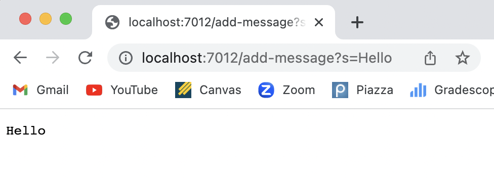

# Week 3 Lab Report

Vivian Wang | A17457779 | v8wang@ucsd.edu

## Part 1

Code for `StringSever`:

```java
import java.io.IOException;
import java.net.URI;
import java.util.ArrayList;

class SearchHandler implements URLHandler {

    ArrayList<String> strings = new ArrayList<>();

    public String handleRequest(URI url) {
        if (url.getPath().equals("/")) {
            return displayStrings();
        }
        else if (url.getPath().contains("/add-message")) {
            String[] temp = url.getQuery().split("=");
            if (temp[0].equals("s")) {
                strings.add(temp[1]);
                return displayStrings();
            }
        }
        return "404 Not Found!";
    }

    private String displayStrings() {
        String output = "";
        if (strings.size() > 0) {
            output = strings.get(0);
            for (int i = 1; i < strings.size(); i++) {
                output += "\n" + strings.get(i);
            }
        }
        return output;
    }
}

class StringServer {
    public static void main(String[] args) throws IOException {
        if(args.length == 0){
            System.out.println("Missing port number! Try any number between 1024 to 49151");
            return;
        }

        int port = Integer.parseInt(args[0]);

        Server.start(port, new SearchHandler());
    }
}
```

Screenshots for using `/add-message`:

* Using `http://localhost:7012/add-message?s=Hello`:
  
  * The`handleRequest` method in `SearchHandler` and the `displayStrings` method in `SearchHandler` are called.
  * The relevant arguments are the arguments under `else if (url.getPath().contains("/add-message"))`  and all the arguments in the `displayStrings` method.
  * The `URI url` changes to `http://localhost:7012/add-message?s=Hello`, the `String[] temp` changes to `[s, Hello]`, the `ArrayList<String> strings` changes to `[Hello]`, and the `String output` changes to `Hello`.
* Using `http://localhost:7012/add-message?s=How are you`:
  
  * The`handleRequest` method in `SearchHandler` and the `displayStrings` method in `SearchHandler` are called.
  * The relevant arguments are the arguments under `else if (url.getPath().contains("/add-message"))`  and all the arguments in the `displayStrings` method.
  * The `URI url` changes to `http://localhost:7012/add-message?s=How are you`, the `String[] temp` changes to `[s, How are you]`, the `ArrayList<String> strings` changes to `[Hello, How are you]`, and the `String output` changes to `Hello \n How are you`.

## Part 2

For the `reversed` method in `ArrayExamples.java`:

* The failure-inducing input:
  ```java
  @Test
    public void testReverseInPlace1() {
      int[] input = {1, 2, 3};
      assertArrayEquals(new int[] {3, 2, 1}, input);
    }
  ```

* The input that doesn't induce a failure:
  ```java
  @Test
    public void testReverseInPlace2() {
      int[] input = {1, 2, 1};
      assertArrayEquals(new int[] {1, 2, 1}, input);
    }
  ```

* The symptom:
  

* The bug:
  Before:

  ```java
  static void reverseInPlace(int[] arr) {
      for(int i = 0; i < arr.length; i += 1) {
      		arr[i] = arr[arr.length - i - 1];
      }
  }
  ```

  After:

  ```java
  // in ArrayExamples.java
  public int[] input;
  
  ArrayExamples(int[] input) {
  		this.input = input;
  }
  
  // Changes the input array to be in reversed order
  public void reverseInPlace() {
      int[] result = new int[input.length];
      for(int i = 0; i < input.length; i += 1) {
    	    result[i] = input[input.length - i - 1];
      }
      input = result;
  }
  
  // in ArrayTests.java
  @Test
  public void testReverseInPlace1() {
  	  ArrayExamples test = new ArrayExamples(new int[] {1, 2, 3});
      test.reverseInPlace();
      assertArrayEquals(new int[] {3, 2, 1}, test.input);
  }
  
  @Test
  public void testReverseInPlace2() {
      ArrayExamples test = new ArrayExamples(new int[] {1, 2, 1});
      test.reverseInPlace();
      assertArrayEquals(new int[] {1, 2, 1}, test.input);
  }
  ```

* Why the fix addresses the issue:
  In the original program, the changes made on `arr` is made on the local variable, which will not affect the initial variable in the caller. So, to make changes on the initial variable, we need to create an instance variable `input` and make changes on it.

## Part 3

This is the first time I learned about web server and git. 