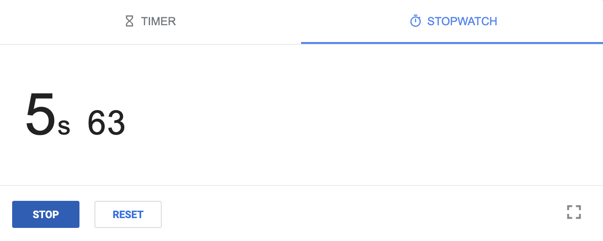

# Week 7 Lab Report

Vivian Wang    A17457779    v8wang@ucsd.edu

## Step 1

**Setup Delete any existing forks of the repository you have on your account**


Keys pressed:

```
<up><enter>
rm -rf l<tab>
go to the lab7 repository om my github page
go to settings, scroll down to the bottom, click "Delete this repository"
type the message as required and press enter
```

Actual commands:

```
ssh cs15lwi23agc@ieng6.ucsd.edu
rm -rf lab7/
```

The `ssh` command is 1 up in the search history, so I used `<up>` to access it. It logs into the ieng6 remote server. I use the `rm` command to remove the existing `lab7`.

Then I go to my github page and delete the existing `lab7` repository.

## Step 2

**Setup Fork the repository**


Keys pressed:

```
go to the lab7 link
click "Fork" on the top right corner
click "Create fork"
```

I go to the link provided in the instruction and fork the `lab7` repository.

## Step 3

**The real deal Start the timer!**



Keys pressed:

```
go to Google, search for timer, click "STOPWATCH", and click "START"
```

I start a timer in Google.

## Step 4

**Log into ieng6**


Keys pressed:

```
<up><enter>
```

Actual commands:

```
ssh cs15lwi23agc@ieng6.ucsd.edu
```

The command is 1 up in the search history, so I use `<up>` to access it. It logs into the ieng6 remote server.

## Step 5

**Clone your fork of the repository from your Github account**


Keys pressed:

```
git clone <Ctrl-V>
```

Actual commands:

```
git clone git@github.com:readyvivian/lab7.git
```

I have copied the SSH before, so I use `<Ctrl-V>` to paste it. The command clone `lab7` from my github account to the remote server.

## Step 6

**Run the tests, demonstrating that they fail**


Keys pressed: 

```
cd l<tab>
<up><up><up><up><up><up><up><up>
<up><up><up><up><up><up><up><up>
```

Actual commands:

```
cd lab7/
javac -cp .:lib/hamcrest-core-1.3.jar:lib/junit-4.13.2.jar *.java
java -cp .:lib/hamcrest-core-1.3.jar:lib/junit-4.13.2.jar org.junit.runner.JUnitCore ListExamplesTests
```

The `javac` and `java` commands are both 8 up in the search history, so I use `<up>` to access it. The commands go into `lab7` and compile and run the junit tests. The result shows that there is one test failed.

## Step 7

**Edit the code file to fix the failing test**


Keys pressed:

```
nano L<tab>.java
go to "result.add(0, s);" and change it to "result.add(s);"
go to the last "index1 += 1;" and change it to "index1 += 1;"
<Ctrl-O><enter><Ctrl-X>
```

Actual commands:

```
nano ListExamples.java
```

The `nano` command opens the text editor for `ListExamples.java`. I use `<tab>` to autofill the file name. In the nano editor, I fix the two bugs, use `<Ctrl-O>` and `<enter>` to save the changes, and use `<Ctrl-X>` to exit.

## Step 8

**Run the tests, demonstrating that they now succeed**


Keys pressed:

```
<up><up><up>
<up><up><up>
```

Actual commands:

```
javac -cp .:lib/hamcrest-core-1.3.jar:lib/junit-4.13.2.jar *.java
java -cp .:lib/hamcrest-core-1.3.jar:lib/junit-4.13.2.jar org.junit.runner.JUnitCore ListExamplesTests
```

The `javac` and `java` commands are both 3 up in the search history, so I use `<up>` to access it. The commands compile and run the junit tests again. This time the result shows that all two tests succeed.

## Step 9

**Commit and push the resulting change to your Github account (you can pick any commit message!)**


Keys pressed:

```
git add *.java
git commit -m "Updated"
git push o<tab>m<tab>
```

Actual commands:

```
git add *.java
git commit -m "Updated"
git push origin main
```

The commands commit the changes with the message "Updated" and push to my github account. I use `<tab>` to autofill the branch name.